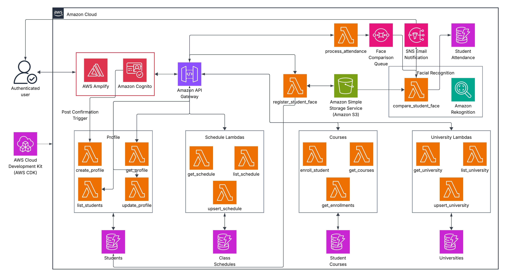

# Smart Attendance Tracker

A cloud-native facial recognition-based attendance tracking system built entirely on AWS infrastructure. This application automates student attendance verification using modern serverless architecture and AI-powered facial recognition technology.

**Live Demo:** [https://main.dvr8m2ur8v0tw.amplifyapp.com](https://main.dvr8m2ur8v0tw.amplifyapp.com)

## Table of Contents
- [Overview](#overview)
- [Architecture](#architecture)
- [AWS Services Used](#aws-services-used)
- [Features](#features)
- [Prerequisites](#prerequisites)
- [Deployment](#deployment)
- [Usage](#usage)
- [Security](#security)
- [Cost Optimization](#cost-optimization)

## Overview

Smart Attendance Tracker eliminates manual attendance tracking by leveraging AWS's facial recognition capabilities. Students register their face once and can mark attendance by simply taking a photo. The system verifies their identity using AWS Rekognition and automatically records their attendance in real-time.

### Key Highlights
- **100% Serverless**: Zero server management, infinite scalability
- **AI-Powered**: 80%+ facial recognition accuracy with AWS Rekognition
- **Event-Driven**: Asynchronous processing with SQS queues for optimal performance
- **Fully Automated**: End-to-end CI/CD deployment with GitHub Actions
- **Cost-Effective**: Pay-per-use model with AWS Free Tier eligible services

## Architecture


*Comprehensive system architecture showing all AWS services and data flow*

### Architecture Overview

The system follows a modern microservices architecture pattern with the following data flow:

1. **User Authentication Flow**:
   - Users sign up/sign in through the React frontend
   - Cognito handles authentication and issues JWT tokens
   - Post-confirmation Lambda trigger automatically creates student profiles

2. **Face Registration Flow**:
   - Student uploads face image via API Gateway
   - Lambda function validates and stores an image in S3
   - Student profile updated with S3 image reference

3. **Attendance Verification Flow**:
   - Student submits an attendance photo through API
   - Lambda function stores image in S3 and creates a pending attendance record
   - Message sent to SQS queue for asynchronous processing
   - Consumer Lambda retrieves both images from S3
   - AWS Rekognition compares faces with 80% similarity threshold
   - Attendance record updated based on a match result
   - SNS notification sent on success/failure

4. **Administrative Flow**:
   - Admins manage universities, courses, and schedules
   - Students enrolled in courses via the admin interface
   - All data persisted in DynamoDB with GSI for efficient queries

## AWS Services Used

This project utilizes **10 distinct AWS services**, exceeding the minimum requirement of 7:

### 1. AWS Lambda (Compute)
**Purpose**: Serverless compute engine for all backend logic

**Why Lambda over EC2**:
- **Event-driven workload**: Attendance verification is sporadic (class times only), making always-on EC2 instances inefficient
- **Cost-effective**: Pay only for execution time (measured in milliseconds)
- **Auto-scaling**: Automatically handles concurrent requests without configuration
- **Zero maintenance**: No server patching, OS updates, or capacity planning

**Implementation**:
- 15+ Lambda functions for different operations (student management, face registration, attendance processing, etc.)
- Python 3.13 runtime on ARM64 architecture for cost efficiency
- Shared Lambda Layer (100MB+) for common utilities, reducing deployment package sizes
- Reserved concurrency controls for face comparison to prevent Rekognition throttling

### 2. Amazon DynamoDB (Database)
**Purpose**: NoSQL database for all persistent data storage

**Why DynamoDB over RDS**:
- **Single-digit millisecond latency**: Critical for real-time attendance verification
- **Serverless scaling**: Automatically scales to accommodate traffic spikes during peak attendance hours
- **Pay-per-request billing**: More cost-effective than provisioned RDS instances for sporadic workloads
- **Global Secondary Indexes**: Enables efficient queries across multiple access patterns without data duplication

**Implementation**:
- 5 tables with strategic partition/sort keys:
  - `Students`: User profiles indexed by user_id with email GSI
  - `StudentAttendance`: Attendance records with a composite key (user_id + date) and attendance_id GSI
  - `ClassSchedules`: Course schedules indexed by schedule_id
  - `Universities`: University information with university_code GSI
  - `StudentCourses`: Enrollment records with schedule_id GSI
- Point-in-time recovery enabled (30-day retention)
- On-demand billing mode for unpredictable workloads

### 3. Amazon S3 (Object Storage)
**Purpose**: Scalable storage for face registration and attendance images

**Why S3 over EBS/EFS**:
- **Unlimited scalability**: Can store millions of student face images without capacity planning
- **99.999999999% durability**: Student face registrations are critical and cannot be lost
- **Lifecycle policies**: Can automatically archive old attendance photos to Glacier for cost savings
- **Direct Lambda integration**: No mounting required, native SDK support

**Implementation**:
- Single encrypted bucket with two logical directories:
  - `face_registrations/`: Permanent student face images
  - `faces/attendance/`: Daily attendance photos (can be archived after grading periods)
- Server-side encryption (SSE-S3) enabled by default
- Versioning is disabled to reduce storage costs
- Block all public access enabled for security

### 4. Amazon Cognito (Authentication & Authorization)
**Purpose**: User authentication, authorization, and user management

**Why Cognito over Custom Auth**:
- **Secure by default**: Industry-standard OAuth 2.0/OpenID Connect implementation
- **Built-in features**: Email verification, password reset, MFA support out-of-the-box
- **JWT token generation**: No need to implement custom token signing/verification
- **User groups**: Native support for role-based access control (Admin, Instructor, Student)
- **Trigger integration**: Post-confirmation Lambda trigger automatically creates student profiles

**Implementation**:
- User Pool with email-based authentication
- Password policy enforcement (8+ chars, mixed case, numbers, symbols)
- Optional MFA with TOTP (not SMS for cost efficiency)
- Three user groups with hierarchical precedence
- 30-day refresh token, 1-hour access/ID tokens
- OAuth 2.0 flows for web application

### 5. Amazon API Gateway (API Management)
**Purpose**: RESTful API gateway for frontend-backend communication

**Why API Gateway over ALB**:
- **Native Lambda integration**: Direct invoke without containers or ECS
- **Built-in throttling**: Rate limiting (100 req/sec, burst 1000) prevents abuse
- **API key management**: Simple authentication layer for additional security
- **Request/response transformation**: Can modify payloads without changing Lambda code
- **CORS handling**: Automatic OPTIONS method handling for web apps

**Implementation**:
- REST API (not HTTP API) for advanced features
- Cognito User Pool authorizer for authentication
- API key requirement on all endpoints for rate limiting
- CloudWatch access logs for monitoring
- JSON request/response formatting
- CORS enabled for web frontend

### 6. Amazon SQS (Message Queue)
**Purpose**: Asynchronous face comparison processing queue

**Why SQS over Synchronous Processing**:
- **Decoupling**: API responds immediately while face comparison happens asynchronously
- **Resilience**: Failed comparisons automatically retried up to 3 times
- **Throttle protection**: Queue buffers requests if Rekognition API limits are hit
- **Cost optimization**: Batch processing of 5 messages reduces Lambda invocations

**Implementation**:
- Standard queue (FIFO not needed for this use case)
- 45-second visibility timeout (matches Lambda timeout)
- 4-day message retention
- Dead Letter Queue (DLQ) for failed comparisons after three attempts
- Long polling (20 seconds) reduces empty receives and costs
- Batch size of 5 with a 5-second batching window

### 7. Amazon SNS (Notifications)
**Purpose**: Attendance notifications and event-driven messaging

**Why SNS over SES/Custom Notifications**:
- **Fan-out pattern**: Single publish can notify multiple subscribers (email, SMS, Lambda, etc.)
- **Protocol flexibility**: Can add SMS, mobile push, or webhooks without code changes
- **Future-proof**: Easy to add notification channels later (e.g., instructor dashboards)

**Implementation**:
- Topic: `attendance-notifications`
- Email subscriptions created during student profile creation
- Published after face comparison (success/failure)
- Can be extended for daily/weekly attendance summaries

### 8. AWS Rekognition (AI/ML)
**Purpose**: AI-powered facial recognition and comparison

**Why Rekognition over Self-Hosted ML**:
- **No ML expertise required**: Fully managed service with pre-trained models
- **High accuracy**: AWS-trained models on billions of images
- **Pay-per-use**: Only charged per image analyzed, no model training costs
- **Scalability**: Handles concurrent requests automatically

**Implementation**:
- `CompareFaces` API with 80% similarity threshold
- Compares an attendance photo against registered face
- Returns confidence score for audit trails
- No face collection storage (GDPR-friendly)

### 9. AWS Amplify (Frontend Hosting & Deployment)
**Purpose**: Static web hosting and CI/CD for React frontend

**Why Amplify over S3+CloudFront**:
- **Git-based deployments**: Auto-deploy on push to main branch
- **Build automation**: Runs npm build in AWS, no local build artifacts
- **Environment variables**: Injects backend URLs at build time
- **Atomic deployments**: Zero-downtime deployments with instant rollback
- **Free SSL**: Automatic HTTPS with AWS-managed certificates

**Implementation**:
- React + TypeScript + Vite SPA
- Automatic builds on GitHub Actions deployment
- Environment variables injected from CDK outputs
- SPA routing with rewrite rules
- Global CDN distribution

### 10. Amazon CloudWatch (Monitoring & Logging)
**Purpose**: Centralized logging, monitoring, and observability

**Why CloudWatch**:
- **Native integration**: All AWS services automatically log to CloudWatch
- **Lambda insights**: Automatic cold start, memory, and error tracking
- **API Gateway logs**: Request/response logging for debugging
- **Cost-effective**: 1-week retention for development, can extend for production
- **Alarms**: Can trigger notifications on errors or throttles

**Implementation**:
- Log groups for each Lambda function (15+ log groups)
- API Gateway access logs with JSON formatting
- 1-week log retention (reduces costs)
- Structured logging for easy querying

### Additional Services (Networking & Security)
While not counted toward the 7-service minimum, these foundational services are also used:

- **AWS IAM**: Least-privilege policies for Lambda execution roles, service-to-service authentication
- **AWS CloudFormation**: Underlying infrastructure for CDK (infrastructure as code)

## Features

### For Students
- **Face Registration**: One-time face upload for identity verification
- **Quick Attendance**: Mark attendance by taking a selfie (verified in seconds)
- **Course Dashboard**: View enrolled courses and attendance history (future development)
- **Email Notifications**: Receive confirmation emails after attendance marked

### For Instructors/Admins
- **University Management**: Create and manage university profiles
- **Course Scheduling**: Set up course schedules with times and locations
- **Student Enrollment**: Enroll students in courses
- **Attendance Reports**: View real-time attendance data (future development)
- **Student Management**: List and manage all registered students

### System Features
- **Multi-University Support**: System supports multiple universities/institutions
- **Role-Based Access Control**: Three user roles (Admin, Student) with different permissions
- **Audit Trail**: All attendance attempts logged with timestamps and confidence scores
- **Retry Mechanism**: Failed face comparisons automatically retried via DLQ
- **Rate Limiting**: API throttling prevents abuse (100 req/sec)

## Prerequisites

Before deploying this application, ensure you have:

1. **AWS Account** with appropriate permissions to create:
   - Lambda functions, DynamoDB tables, S3 buckets
   - Cognito User Pools, API Gateway
   - SQS queues, SNS topics
   - CloudWatch logs, IAM roles

2. **AWS CLI** configured with credentials:
   ```bash
   aws configure
   ```

3. **Node.js** (v22+) and npm:
   ```bash
   node --version  # Should be v22+
   ```

4. **Python** (3.13+) for Lambda functions:
   ```bash
   python3 --version  # Should be 3.13+
   ```

5. **AWS CDK CLI**:
   ```bash
   npm install -g aws-cdk
   cdk --version
   ```

6. **Docker** (for Lambda layer bundling):
   ```bash
   docker --version
   ```

7. **GitHub Account** (for CI/CD automation)

## Deployment

### Option 1: Automated Deployment (Recommended)

The application uses **GitHub Actions** for fully automated CI/CD deployment:

1. **Fork/Clone the Repository**:
   ```bash
   git clone https://github.com/VarunShelke/smart-attendance-tracker.git
   cd smart-attendance-tracker
   ```

2. **Configure GitHub Secrets**:
   - Go to repository Settings → Secrets → Actions
   - Add the following secret:
     - `AWS_DEPLOY_ROLE_ARN`: ARN of an IAM role for OIDC authentication

3. **Create OIDC Provider** (one-time setup):
   ```bash
   # This allows GitHub Actions to authenticate with AWS without storing credentials
   aws iam create-open-id-connect-provider \
     --url https://token.actions.githubusercontent.com \
     --client-id-list sts.amazonaws.com \
     --thumbprint-list 6938fd4d98bab03faadb97b34396831e3780aea1
   ```

4. **Create Deployment Role**:
   ```bash
   # Create IAM role that GitHub Actions can assume
   # See .github/workflows/deploy-cdk.yml for trust policy
   ```

5. **Push to Main Branch**:
   ```bash
   git add .
   git commit -m "Initial deployment"
   git push origin main
   ```

6. **Monitor Deployment**:
   - Go to repository Actions tab
   - Watch the `Deploy CDK Infrastructure` workflow
   - Deployment takes ~6-10 minutes
   - Frontend URL will be available in workflow outputs

### Deployment Workflow

The GitHub Actions workflow performs:

1. **Validation Phase**:
   - CDK synth to validate infrastructure code
   - TypeScript compilation check
   - Python dependency installation
   - Docker setup for Lambda layer bundling

2. **Security Scan Phase**:
   - npm audit for Node.js dependencies
   - TruffleHog secret scanning
   - Checks for high/critical vulnerabilities

3. **Infrastructure Deployment**:
   - AWS credential authentication via OIDC
   - CDK diff to show changes
   - CDK deploys with all resources
   - CloudFormation stack validation
   - Output extraction (API endpoints, Cognito pools, etc.)

4. **Frontend Deployment**:
   - Environment variable injection from CDK outputs
   - Vite build with production configuration
   - ZIP artifact creation
   - Amplify deployment via AWS CLI
   - Deployment status monitoring (polls every 10 seconds)
   - URL accessibility verification

5. **Post-Deployment Validation**:
   - Stack status verification
   - Required outputs validation
   - Frontend accessibility check

### Option 2: Manual Deployment

For development or testing:

1. **Deploy Infrastructure**:
   ```bash
   cd infrastructure
   npm install
   npm run build
   cdk bootstrap  # First time only
   cdk deploy
   ```

2. **Note CDK Outputs**:
   - Copy UserPoolId, UserPoolClientId, ApiEndpoint, ApiKeyValue

3. **Build Frontend**:
   ```bash
   cd ../frontend
   npm install

   # Create .env.local with CDK outputs
   echo "VITE_AWS_REGION=us-east-1" > .env.local
   echo "VITE_AWS_USER_POOL_ID=your-pool-id" >> .env.local
   echo "VITE_AWS_USER_POOL_CLIENT_ID=your-client-id" >> .env.local
   echo "VITE_API_ENDPOINT=your-api-endpoint" >> .env.local
   echo "VITE_API_KEY=your-api-key" >> .env.local

   npm run build
   ```

4. **Deploy to Amplify**:
   ```bash
   # Get Amplify App ID from CDK outputs
   aws amplify create-deployment --app-id YOUR_APP_ID --branch-name main
   # Follow prompts to upload build artifact
   ```

## Usage

### Initial Setup

1. **Access the Application**:
   - Navigate to the Amplify URL from deployment outputs
   - Example: `https://main.dvr8m2ur8v0tw.amplifyapp.com`

2. **Create Admin Account**:
   ```bash
   # Create user via Cognito CLI
   aws cognito-idp admin-create-user \
     --user-pool-id YOUR_USER_POOL_ID \
     --username admin@example.com \
     --temporary-password TempPassword123! \
     --user-attributes Name=email,Value=admin@example.com

   # Add to Admin group
   aws cognito-idp admin-add-user-to-group \
     --user-pool-id YOUR_USER_POOL_ID \
     --username admin@example.com \
     --group-name Admin
   ```

3. **Log In**:
   - Use temporary password to log in
   - Set a new permanent password when prompted

### Student Workflow

1. **Register Account**:
   - Click "Sign Up" on the login page
   - Enter email, name, and password
   - Verify email via confirmation link
   - System automatically creates a student profile

2. **Register Face**:
   - Log in to the dashboard
   - Navigate to Profile → Register Face
   - Upload a clear face photo (frontal view, good lighting)
   - Wait for a confirmation message

3. **Mark Attendance**:
   - Navigate to Courses
   - Select active course
   - Click "Mark Attendance"
   - Take selfie or upload a photo
   - System verifies identity and confirms attendance
   - Receive email notification

### Instructor/Admin Workflow

1. **Create University**:
   - Navigate to Admin → Universities
   - Click "Add University"
   - Enter university code, name, and details

2. **Create Course Schedule**:
   - Navigate to Admin → Schedules
   - Click "Add Schedule"
   - Enter course code, name, meeting times, instructor

3. **Enroll Students**:
   - Navigate to Admin → Students
   - Select student
   - Click "Enroll in Course"
   - Select course schedule

## Security

### Authentication & Authorization
- **Multi-Factor Authentication**: Optional TOTP-based MFA for sensitive accounts
- **Password Policy**: Enforces strong passwords (8+ chars, mixed case, numbers, symbols)
- **JWT Tokens**: Short-lived access tokens (1 hour) with 30-day refresh tokens
- **Role-Based Access**: Three user groups with hierarchical permissions
- **API Keys**: All API requests require valid API key for rate limiting

### Data Protection
- **Encryption at Rest**: S3 buckets use SSE-S3, DynamoDB encrypted by default
- **Encryption in Transit**: All API calls over HTTPS/TLS 1.2+
- **Private Buckets**: S3 bucket blocks all public access
- **Pre-signed URLs**: Temporary S3 access without exposing credentials

### Network Security
- **CORS Configuration**: Strict origin whitelisting (localhost + production domain)
- **API Throttling**: Rate limiting prevents DDoS attacks (100 req/sec, burst 1000)
- **Cognito Authorizer**: All protected endpoints require valid JWT token
- **Least Privilege IAM**: Lambda functions have minimal permissions for their specific tasks

### Compliance & Privacy
- **No Face Collection**: Rekognition CompareFaces doesn't store biometric data
- **Data Retention**: 1-week CloudWatch logs, configurable DynamoDB retention
- **Point-in-Time Recovery**: DynamoDB backups for 30 days
- **Audit Trails**: All attendance attempts logged with timestamps

### Security Best Practices
- **Secrets Management**: No hardcoded credentials, all secrets in environment variables
- **Dependency Scanning**: GitHub Actions runs npm audit on every push
- **Secret Scanning**: TruffleHog checks for committed secrets
- **OIDC Authentication**: GitHub Actions uses OIDC instead of long-lived credentials

## Cost Optimization

This application is designed to be extremely cost-effective, primarily using AWS Free Tier services:

### Free Tier Eligible Services

1. **AWS Lambda**:
   - 1M requests/month + 400,000 GB-seconds free
   - Estimated: <5,000 requests/month = **$0/month**

2. **DynamoDB**:
   - 25 GB storage + 200M requests/month free
   - Estimated: <1 GB storage + <100K requests = **$0/month**

3. **S3**:
   - 5 GB storage + 20,000 GET requests free
   - Estimated: <1 GB (face images) = **$0/month**

4. **API Gateway**:
   - 1M REST API requests/month free (first 12 months)
   - Estimated: <10,000 requests = **$0/month** (first year)

5. **Cognito**:
   - 50,000 MAUs free forever
   - Estimated: <100 users = **$0/month**

6. **CloudWatch**:
   - 5 GB logs + 10 custom metrics free
   - Estimated: <1 GB logs = **$0/month**

### Paid Services (Minimal Cost)

1. **SQS**: $0.40 per 1M requests
   - Estimated: <1,000 requests/month = **$0.001/month**

2. **SNS**: $0.50 per 1M requests
   - Estimated: <100 emails/month = **$0.001/month**

3. **Rekognition**: $1.00 per 1,000 face comparisons
   - Estimated: <100 comparisons/month = **$0.10/month**

4. **Amplify**: $0.01 per build minute + $0.15/GB served
   - Estimated: 5 min builds + <1 GB/month = **$0.20/month**

### Monthly Cost Estimate

- **Development/Testing**: ~$0.30/month (mostly Free Tier)
- **Small University (100 students)**: ~$2-5/month
- **Medium University (1,000 students)**: ~$15-25/month
- **Large University (10,000 students)**: ~$100-150/month

### Cost Optimization Strategies

1. **ARM64 Architecture**: Lambda functions use Graviton2 (20% cost reduction)
2. **Short Timeouts**: Lambda functions have minimal timeouts (10-45 seconds)
3. **Log Retention**: 1-week CloudWatch log retention (vs. indefinite)
4. **DynamoDB On-Demand**: Pay per request vs. provisioned capacity
5. **S3 Lifecycle Policies**: Can archive old attendance photos to Glacier
6. **No NAT Gateway**: Lambdas don't need VPC access, avoiding $32/month NAT Gateway
7. **Shared Lambda Layer**: 100MB+ shared code reduces deployment sizes
8. **SQS Batching**: Batch size of 5 reduces Lambda invocations by 80%
9. **Long Polling**: SQS long polling reduces empty receives
10. **Smart Caching**: API responses can be cached (not implemented yet)

## Project Structure

```
smart-attendance-tracker/
├── .github/
│   └── workflows/
│       ├── deploy-cdk.yml              # Main deployment workflow
│       ├── build-frontend.yml          # Frontend validation
│       └── build-infrastructure.yml    # Infrastructure validation
├── backend/
│   └── src/
│       └── lambda/
│           ├── attendance/              # Face registration & verification
│           ├── student/                 # Student profile & course management
│           ├── university/              # University CRUD operations
│           ├── schedule/                # Course schedule management
│           ├── utils/                   # Shared utilities
│           ├── constants/               # Configuration constants
│           └── requirements.txt         # Python dependencies
├── frontend/
│   ├── src/
│   │   ├── components/                  # React components
│   │   ├── pages/                       # Page components
│   │   ├── services/                    # API client
│   │   ├── contexts/                    # React contexts
│   │   └── utils/                       # Frontend utilities
│   ├── package.json                     # Node.js dependencies
│   └── vite.config.ts                   # Vite configuration
├── infrastructure/
│   ├── lib/
│   │   └── smart-attendance-tracker-stack.ts  # CDK stack definition
│   ├── bin/
│   │   └── app.ts                       # CDK app entry point
│   ├── package.json                     # CDK dependencies
│   └── cdk.json                         # CDK configuration
└── README.md                            # This file
```

## Technical Stack

### Frontend
- **Framework**: React 18 with TypeScript
- **Build Tool**: Vite (faster than Webpack)
- **Styling**: Tailwind CSS
- **State Management**: React Context API
- **Authentication**: AWS Amplify Auth
- **HTTP Client**: Axios
- **Routing**: React Router v6

### Backend
- **Runtime**: Python 3.13 on AWS Lambda (ARM64)
- **Framework**: Serverless (no web framework needed)
- **Database**: Amazon DynamoDB (NoSQL)
- **Storage**: Amazon S3
- **API**: Amazon API Gateway (REST)
- **Queue**: Amazon SQS (Standard Queue)
- **AI/ML**: AWS Rekognition

### Infrastructure
- **IaC Tool**: AWS CDK (TypeScript)
- **CI/CD**: GitHub Actions
- **Monitoring**: Amazon CloudWatch
- **Hosting**: AWS Amplify

### Development Tools
- **Version Control**: Git + GitHub
- **Package Managers**: npm (Node.js) + pip (Python)
- **Linting**: ESLint (frontend) + Ruff (backend)
- **Type Checking**: TypeScript + Python type hints

## Development

### Local Development Setup

1. **Clone Repository**:
   ```bash
   git clone https://github.com/VarunShelke/smart-attendance-tracker.git
   cd smart-attendance-tracker
   ```

2. **Backend Development**:
   ```bash
   cd backend/src/lambda
   python3 -m venv venv
   source venv/bin/activate
   pip install -r requirements.txt

   # Run tests (if implemented)
   pytest tests/
   ```

3. **Frontend Development**:
   ```bash
   cd frontend
   npm install

   # Create .env.local with API endpoints
   cp .env.example .env.local
   # Edit .env.local with your values

   # Start dev server
   npm run dev
   ```

4. **Infrastructure Development**:
   ```bash
   cd infrastructure
   npm install
   npm run build

   # Validate CDK code
   cdk synth

   # Preview changes
   cdk diff
   ```

### Testing

1. **Frontend Tests**:
   ```bash
   cd frontend
   npm run test           # Run unit tests
   npm run test:e2e       # Run E2E tests (if implemented)
   npm run lint           # Run ESLint
   npx tsc --noEmit       # Type check
   ```

2. **Infrastructure Tests**:
   ```bash
   cd infrastructure
   npm run build          # TypeScript compilation
   npx tsc --noEmit       # Type check
   cdk synth              # Synthesize CloudFormation
   ```

3. **Integration Testing**:
   ```bash
   # Deploy to test environment
   cdk deploy --context environment=test

   # Run integration tests against test stack
   npm run test:integration
   ```

## CI/CD Pipeline

The project uses GitHub Actions for automated deployment:

### Workflow Triggers
- **Push to `main`**: Full deployment to production
- **Pull Request**: Build validation and security scans
- **Manual Trigger**: On-demand deployment to specific environment

### Pipeline Stages

1. **Validation** (2-3 min):
   - Install dependencies
   - Build TypeScript and Python code
   - Run CDK synth
   - Check for infrastructure changes

2. **Security Scan** (1-2 min):
   - npm audit for vulnerabilities
   - TruffleHog secret scanning
   - Fail on high/critical issues

3. **Infrastructure Deployment** (6-8 min):
   - Authenticate with AWS via OIDC
   - Deploy CDK stack
   - Verify deployment success
   - Extract outputs (API endpoints, etc.)

4. **Frontend Deployment** (1-2 min):
   - Build React app with environment variables
   - Create deployment ZIP
   - Upload to Amplify
   - Monitor deployment status
   - Verify URL accessibility

5. **Notifications**:
   - Success/failure notification
   - Deployment metrics

### Deployment Environments

- **Production**: `main` branch → Production stack
- **Development**: Feature branches → Local testing only
- **Testing**: `develop` branch → Test stack (if configured)

## Monitoring & Debugging

### CloudWatch Logs

1. **View Lambda Logs**:
   ```bash
   # List all log groups
   aws logs describe-log-groups --log-group-name-prefix "/aws/lambda"

   # Tail specific Lambda logs
   aws logs tail /aws/lambda/register-student-face --follow
   ```

2. **View API Gateway Logs**:
   ```bash
   aws logs tail /aws/apigateway/smart-attendance --follow
   ```

### Metrics & Alarms

1. **Lambda Metrics**:
   - Invocations, errors, duration, throttles
   - Available in CloudWatch console

2. **API Gateway Metrics**:
   - Request count, latency, 4XX/5XX errors
   - Available in API Gateway console

3. **DynamoDB Metrics**:
   - Read/write capacity, throttled requests
   - Available in DynamoDB console

### Debugging Tips

1. **Face Comparison Failures**:
   - Check SQS DLQ for failed messages
   - Review CloudWatch logs for compare-student-face Lambda
   - Verify face images exist in S3
   - Check Rekognition confidence scores

2. **Authentication Issues**:
   - Verify Cognito User Pool configuration
   - Check JWT token expiration
   - Review API Gateway authorizer logs

3. **API Errors**:
   - Check API Gateway access logs
   - Review Lambda execution logs
   - Verify CORS configuration

## Troubleshooting

### Common Issues

1. **CDK Deployment Fails**:
   ```bash
   # Check AWS credentials
   aws sts get-caller-identity

   # Verify CDK bootstrap
   cdk bootstrap aws://ACCOUNT-ID/REGION

   # Check CloudFormation events
   aws cloudformation describe-stack-events --stack-name SmartAttendanceTrackerStack
   ```

2. **Frontend Build Fails**:
   ```bash
   # Clear node_modules and reinstall
   rm -rf node_modules package-lock.json
   npm install

   # Verify environment variables
   cat .env.local
   ```

3. **Lambda Timeout**:
   - Check Lambda timeout configuration (default: 30s)
   - Review CloudWatch logs for slow operations
   - Increase timeout if needed (max: 15 min)

4. **Rekognition Errors**:
   - Verify images are valid (JPEG/PNG, <5MB)
   - Check face quality (frontal view, good lighting)
   - Review similarity threshold (default: 80%)

## Contributing

1. Fork the repository
2. Create feature branch: `git checkout -b feature/your-feature`
3. Commit changes: `git commit -am 'Add some feature'`
4. Push to branch: `git push origin feature/your-feature`
5. Submit pull request

### Code Style

- **TypeScript**: Follow Airbnb style guide, enforced by ESLint
- **Python**: Follow PEP 8, enforced by Ruff
- **Commits**: Use conventional commits (feat:, fix:, docs:, etc.)

## License

This project is licensed under the MIT License – see the LICENSE file for details.

## Acknowledgments

- **Course**: CS2060 – Cloud Computing
- **University**: University of Pittsburgh
- **Instructor**: Prof. Dan Mahoney
- **Team Members**: Varun Shelke
- **AWS Services**: Built entirely on AWS infrastructure
- **Open Source**: React, TypeScript, AWS CDK, and other open-source libraries

## Contact

For questions or issues, please open a GitHub issue or contact:

- **Email**: vps27@pitt.edu
- **GitHub**: [@VarunShelke](https://github.com/VarunShelke)
- **Repository**: [smart-attendance-tracker](https://github.com/VarunShelke/smart-attendance-tracker)

---

**Note**: This project was developed as part of the CS1660/2060 Cloud Computing course at the University of Pittsburgh. The application demonstrates practical implementation of cloud-native architecture patterns, serverless computing, and modern DevOps practices on AWS.
